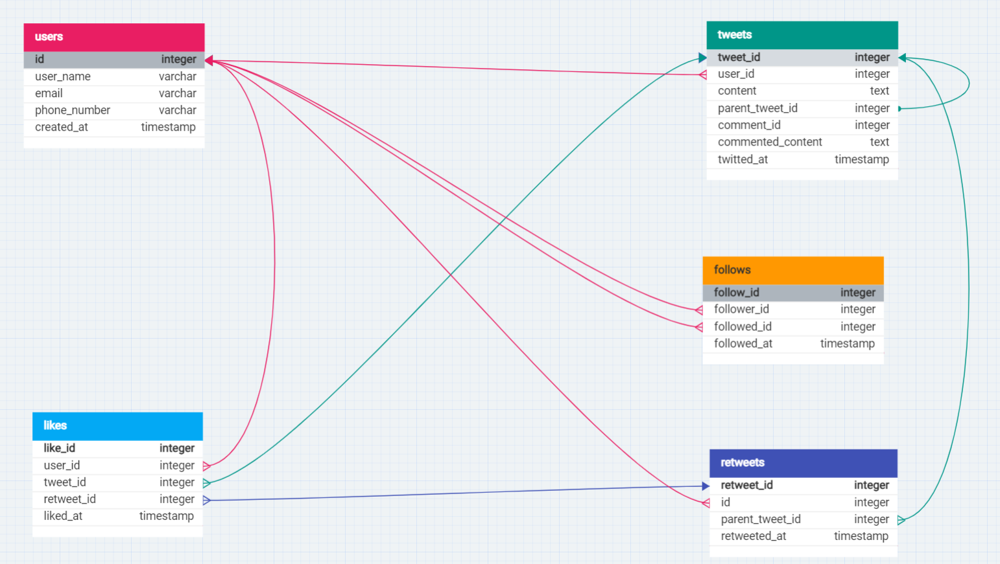

# 📱Twitter Database Schema

 
## 🟢 Requirements and Goals of the System
**Functional Requirements:**
- Users should be able to post new tweets.
- A user should be able to follow other users.
- Users should be able to mark tweets as favorites.
- The service should be able to create and display a user’s timeline consisting of top tweets from all the people the user follows.
- Tweets can contain photos and videos.

**Non-functional Requirements:**
- Our service needs to be highly available.
- The acceptable latency of the system is 200ms for timeline generation.
- Consistency can take a hit (in the interest of availability). It should be fine if a user doesn’t see a tweet for a while.

  

## 🟢 Table and Attributes

### Users Table:
- **Columns**:
  - `id`: Primary key, auto-incrementing integer
  - `username`: Unique username for each user
  - `full_name`: Full name of the user
  - `email`: Unique email address of the user
  - `phone_number`: Unique phone number of the user
  - `password`: Hashed password for user authentication
  - `bio`: User biography or description
  - `created_at`: Timestamp indicating user registration date
 
### Users Table:
- **Columns**:
  - `id`: Primary key, auto-incrementing integer
  - `user_name`: Username of the user
  - `email`: Unique email address of the user
  - `phone_number`: Unique phone number of the user
  - `created_at`: Timestamp indicating user registration date

### Tweets Table:
- **Columns**:
  - `tweet_id`: Primary key, auto-incrementing integer
  - `user_id`: Foreign key referencing the `id` column in the `Users` table
  - `content`: Text content of the tweet
  - `parent_tweet_id`: References the `tweet_id` of the parent tweet (if any)
  - `comment_id`: Identifier for tweet comments
  - `commented_content`: Text content of the commented tweet (if applicable)
  - `twitted_at`: Timestamp indicating tweet creation date

### Follows Table:
- **Columns**:
  - `follow_id`: Primary key, auto-incrementing integer
  - `follower_id`: Foreign key referencing the `id` column in the `Users` table for the follower
  - `followed_id`: Foreign key referencing the `id` column in the `Users` table for the followed user
  - `followed_at`: Timestamp indicating when the follow relationship was established

### Retweets Table:
- **Columns**:
  - `retweet_id`: Primary key, auto-incrementing integer
  - `id`: Foreign key referencing the `id` column in the `Users` table for the user who retweeted
  - `parent_tweet_id`: Foreign key referencing the `tweet_id` column in the `Tweets` table for the original tweet
  - `retweeted_at`: Timestamp indicating when the retweet occurred

### Likes Table:
- **Columns**:
  - `like_id`: Primary key, auto-incrementing integer
  - `user_id`: Foreign key referencing the `id` column in the `Users` table for the user who liked
  - `tweet_id`: Foreign key referencing the `tweet_id` column in the `Tweets` table for the liked tweet
  - `retweet_id`: Foreign key referencing the `retweet_id` column in the `Retweets` table for the liked retweet
  - `liked_at`: Timestamp indicating when the like was registered
